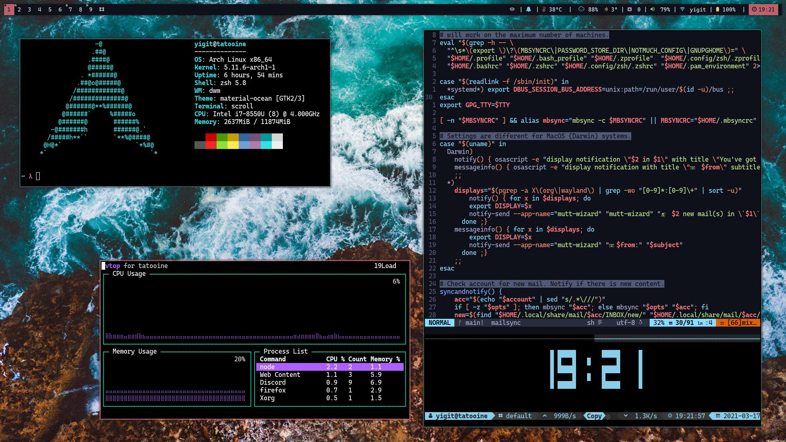
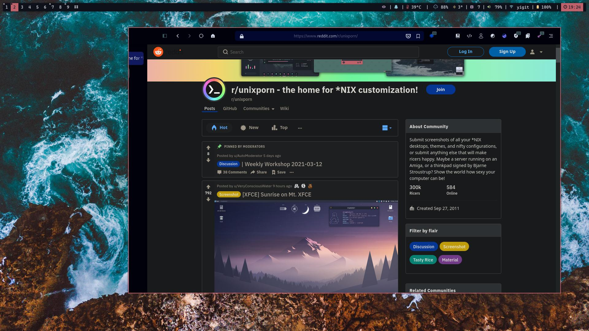
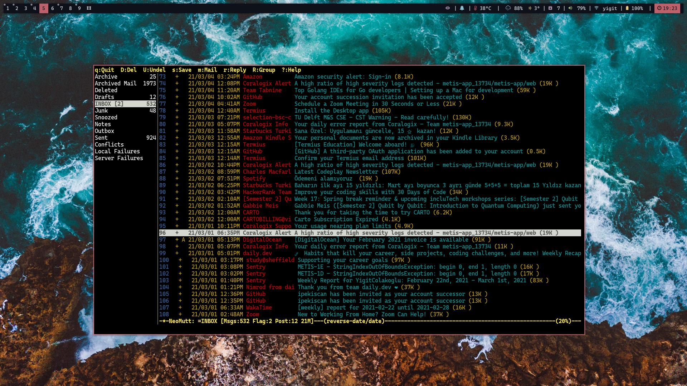

# Fr1nge's Dotfiles

Welcome to my dungeon. Here, I keep all my configuration files in case I have a stroke and lose all my memory. You're very welcome to explore and use anything in this repository. Have fun!

## My Setup: 

*  Arch Linux
* DWM ([dwm-flexipatch](https://github.com/bakkeby/dwm-flexipatch))
* dmenu
* st (simple terminal)
* dunst
* zsh with powerlevel10k and antibody
* tmux
* zathura
* [Material Ocean](https://github.com/material-ocean/) color scheme for pretty much everything

## Installation

Just run 
```sh
git clone --recurse-submodules https://github.com/theFr1nge/dotfiles.git ~/.dotfiles && ~/.dotfiles/install.sh
```
This will download everything you need. After that, I have a list of all the packages I have installed on my machine in the directory chroot/. If you have any problems regarding the setup, you should first check whether you have missing packages. After the clone process, it is pretty straightforward, you can run the `install.sh` script which creates necessary symlinks. Finally, DO NOT FORGET to run sudo make clean install in each directory under suckless, I also have a script named build.sh in that directory which does that automatically. 

## Some eye candy

 
 
 
 

